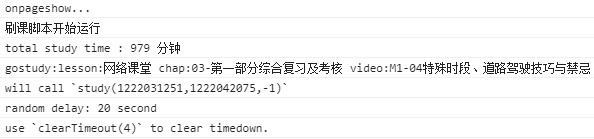
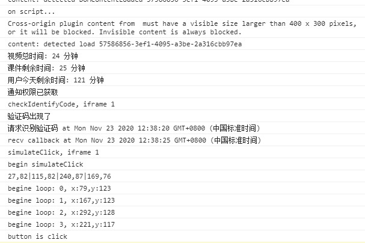

hz.5u5u5u5u.com 自动刷课脚本

## 如本项目对你有帮助,还请给个 star 表示支持.

## 解决的问题

- 自动进入视频课程, (20-30 秒随机延迟).
- 防切后台停止计时
- 打码,这里使用了超级鹰打码,需要去 `www.chaojiying.com` 注册账号, (完成 20 个小时课程打码大约需要 3 元人民币).

## 使用方法

1. 使用 chrome 安装好 tampermonkey 插件
2. 导入脚本两个脚本
3. 注册打码账号,在 5u_video_auto_sign.js 填入自己的账号密码和 softid.
4. 登录 5u5u5u5u,完成人像采集
5. 打开浏览器控制台,进入我的课程页面,查看运行状态.如看到`刷课脚本开始运行`提示字样表示正常,如没有看到也可在控制台输入`gostudy_time_handle`看看定时器句柄是否存在.
6. 
7. 挂机即可.
8. 
9. 本人使用时间为 2020 年 11 月 10-15 号.浏览器为 chrome87 版本, 目标域名为`https://hz.5u5u5u5u.com`, 如网站更新/环境导致脚本失效可自行 fork 修改.

## 脚本简介

- 5u_auto_go_video.js:
  匹配 `hz.5u5u5u5u.com/toLessonList.action*` 会获取用户还没有看到视频,并且随机延时后调用视频进入视频页码
- 5u_video_auto_sign.js: `hz.5u5u5u5u.com/studyOnLine*`
  15 秒定时侦测验证码是否弹出,调用打码 api 自动填码,视频观看完毕后跳回列表页面,再次延迟开始观看,直到看完用户观看时间上线为止
  这个脚本抄了`https://zjd0112.github.io/2019/02/20/browse-video-automatically` 的实现(感谢`zjd0112`为开源做出的共享).并且做了修改和修正,
  如加上了防止停止计时(实现原理是屏蔽 hide 事件).

- 常见问题
  - 视频播放完成,但是没有打卡签退?
    这是由于视频计时时间比视频长度长导致.签退以计时时间为准
  - 打码平台准确率不高/响应慢
    自行更换打码 api
  - 其他问题
    自行解决/和作者交流

## 免责声明

本项目仅为学习交参考流用,本人对于他人在使用/引用此项目造成的任何结果均不承担任何责任.
